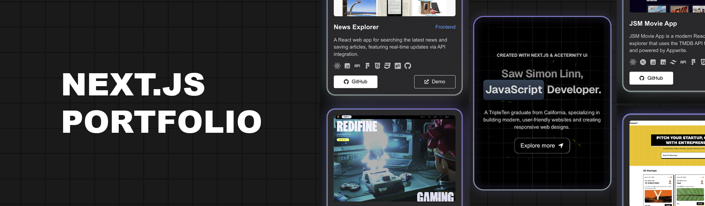
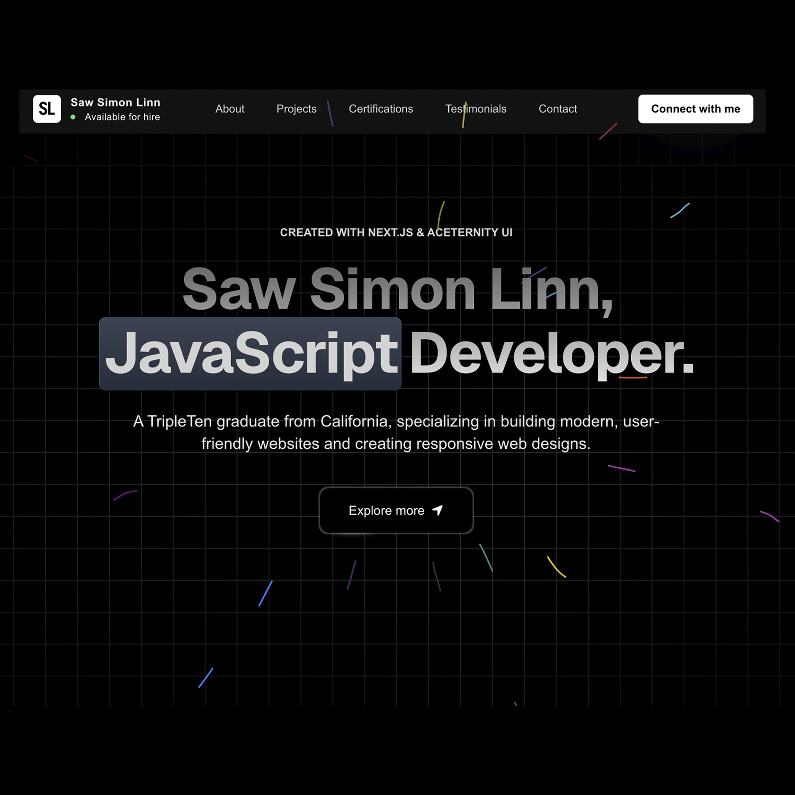
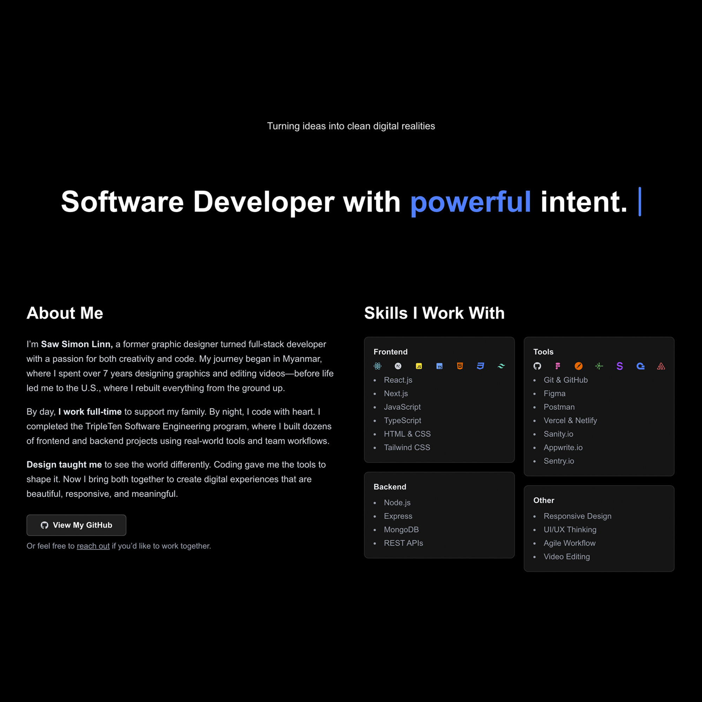
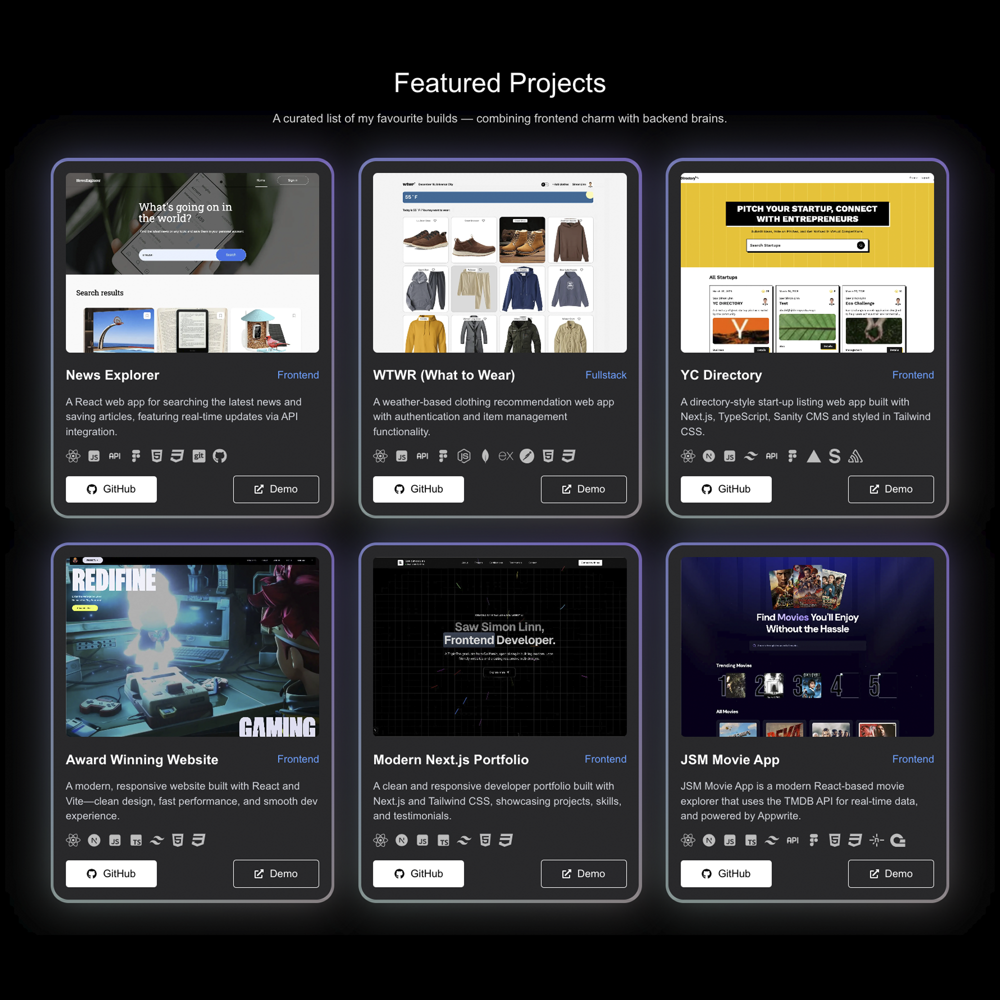
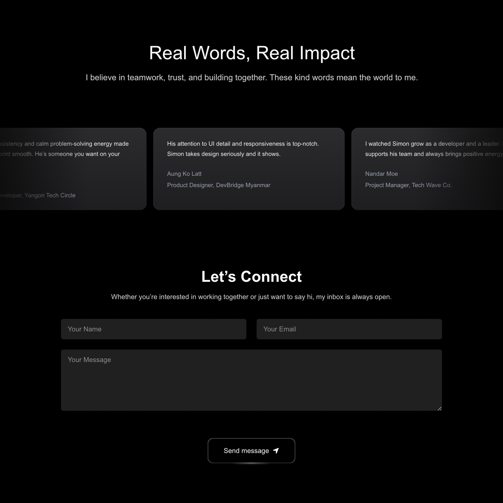

<p align="center">
  
  
  
  
</p>

<h2 align="center">✨ Modern Next.js Portfolio ✨</h2>

<p align="center">
  A clean, animated portfolio crafted from scratch using <strong>Next.js</strong>, <strong>TailwindCSS</strong>, and <strong>Aceternity UI</strong>. 
  This project features beautiful animations powered by <strong>Framer Motion</strong>, dynamic project routing, and smooth scroll effects — all wrapped in a responsive layout.
</p>

---

## 🔥 Features

- ⚡ Built with **Next.js 14** & **Tailwind CSS**
- 🎨 Styled with **Aceternity UI** components
- 🎞️ Smooth animations using **Framer Motion**
- 🧠 Dynamic routing via `/projects/[slug]`
- 📱 Fully responsive & SEO-optimized
- 🌗 Easy to extend with light/dark mode toggle (optional)
- 🥷 Custom preloader with typing + welcome effect

---

## 📸 Screenshot







---

## 🚀 Live Demo

👉 [Visit Portfolio Website](https://www.sawsimonlinn.com)

---

## 🛠️ Setup & Run

```bash
git clone https://github.com/SawSimonLinn/nextjs-portfolio.git
cd nextjs-portfolio
npm install
npm run dev
```

## 💬 Feedback

- Feel free to connect with me or drop feedback via [LinkedIn](https://www.linkedin.com/in/sawsimonlinn/)
- Let’s build something magical together! 💻✨

Simon Linn 🖤
